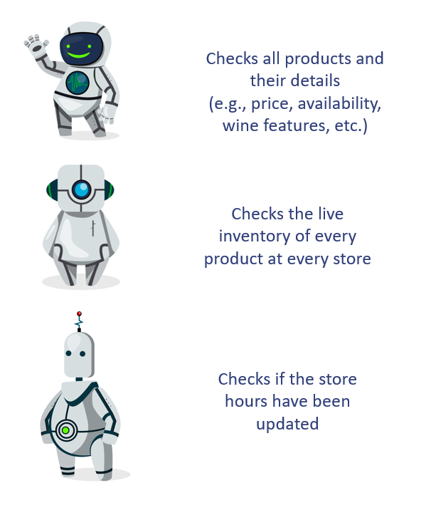

# LCBO Web Scraper Bots

## Description

My scraper collects three sets of data from the LCBO website:

>Designed by pch.vector / Freepik

There are approximately registered products: 9,400 wine and 4,100 non-wine. "Non-wine" products can include beer, liquor, and reusuable bags.

## How does it work?

When a Github Actions workflow (see .github/workflows/) is triggered, a bash script is executed. The bash script contains a cURL command that returns a JSON with the desired data. That's it! 

For an in-depth guide, check out these blog posts:

1. [Scraping LCBO Data (Part 1: Store Information)](https://royourboat.github.io/posts/2023-06-01-lcbo-scraper/)
2. [Scraping LCBO Data (Part 2: Product Inventory)](https://royourboat.github.io/posts/2023-06-10-lcbo-scraper/)
3. [Scraping LCBO Data (Part 3: Product Descriptions)](https://royourboat.github.io/posts/2023-06-17-lcbo-scraper/)
4. [Making my own scraper bot!](https://royourboat.github.io/posts/2023-06-22-lcbo-github-actions-bot/)
5. [DIY Wine Database with postgreSQL](https://royourboat.github.io/posts/2023-07-01-lcbo-psql/)

## How can I use it?

* Fork this repository! 
* Settings > Actions > Workflow permissions: Read and write permissions
* Modify the frequency (cron) of scraping in the workflow files in .github/workflows. 
* Please scrape gently. I purposely do not run simultaneous scraping jobs because (a) I am in no rush, (b) I don't want LCBO to be mad and change their setup, and (c) it is a waste of free cpu minutes. 

## Authors

Stephen Ro 

[Website](https://royourboat.github.io/)

## Inspirations

* Simon Willison's Github Actions [demo](https://github.com/simonw/ca-fires-history) and [YT video](https://www.youtube.com/watch?v=2CjA-03yK8I)!
* My experiences at LCBO stores

## License

This project is licensed under the BSD 3-Clause License - see the LICENSE.md file for details
